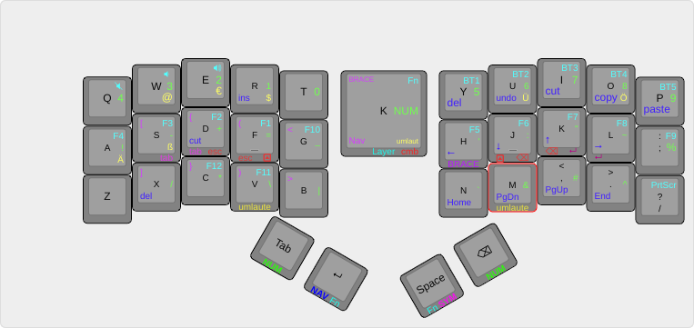
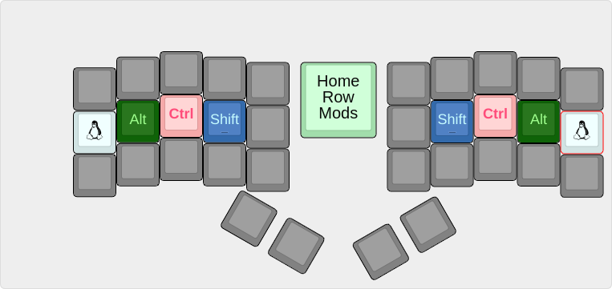
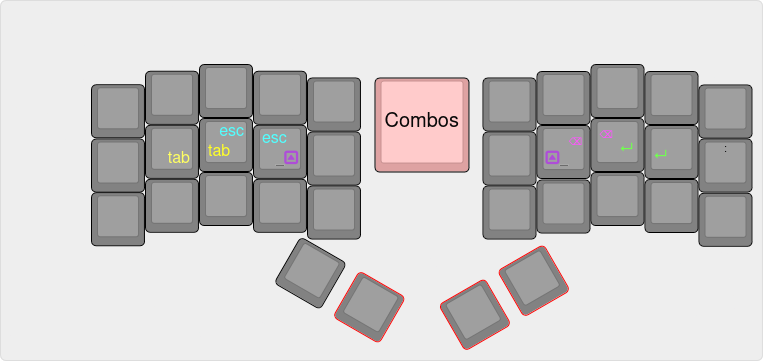
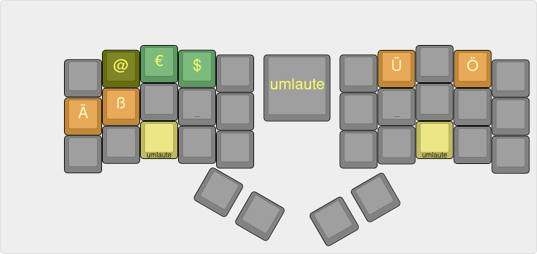
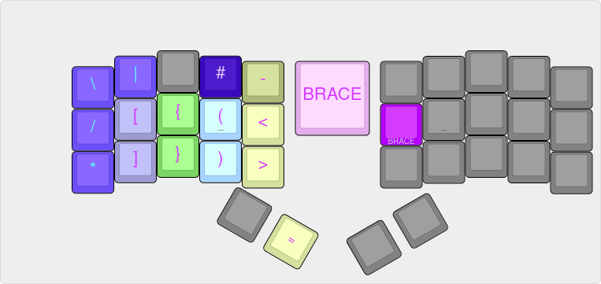
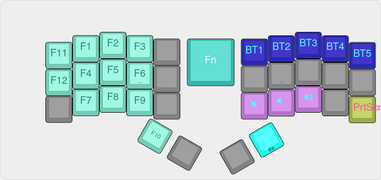

# Keymap for 34 key keyboard


To edit the keyboard, edit the ./config/cradio.keymap

With each push to the repository a new firmware is built via the .github workflow. 
Then attach one halve to the computer via usb. Set it into usb mode by [double click on the reset button](https://zmk.dev/docs/user-setup#flashing-uf2-files). Copy the right firmeware to each halve. It does not have to be renamed. When the file is copied, the usb-drive automatically disconnects and the firmware is enabled.

## General Thoughts
All keys in this document are named by the default qwerty character on the key. 
The thumb keys are named after this schema from [zmk-nodefree-config](https://github.com/urob/zmk-nodefree-config). This library is also used for defining the keymaps.
```
╭─────────────────────┬─────────────────────╮
│ LT4 LT3 LT2 LT1 LT0 │ RT0 RT1 RT2 RT3 RT4 │
│ LM4 LM3 LM2 LM1 LM0 │ RM0 RM1 RM2 RM3 RM4 │
│ LB4 LB3 LB2 LB1 LB0 │ RB0 RB1 RB2 RB3 RB4 │
╰──────────╮  LH1 LH0 │ RH0 RH1  ╭──────────╯
           ╰──────────┴──────────╯
```
Use key combos for common keys: Escape, Enter, Backspace,[CapsWord](https://zmk.dev/docs/behaviors/caps-word), Tab

## Home Row Mods
Use [home-row-mods](https://precondition.github.io/home-row-mods#gacs)


## Layer Change Keys
* Hold RH1 or LH1 for Numbers Layer 
* Hold LH0 for Navigation Layer
* Hold m or v for Umlaut Layer
* Hold RH0 for function Layer
* Hold h for Braces Layer

On all layers except from 0, the free thumb keys do not trigger a layer change, they do the same thing as on the base layer, but with enabled repeat. That way these layer change keys can be repeated.

## Combos
* j+k Backspace
* d+f Escape
* f+j Capsword
* k+l Enter
* s+d Tab
* a+; Super tap (same as home row mods, instead of hold)



## Base Layer
qwerty

LH1 tab, LH0 enter, RH0 space, RH1 backspace 


Here all other layers start.

## Umlaut Layer (hold v or m)
each umlaut on it's laut.
Euro, Dollar and @ are on the umlaut layer.


## Navigation layer (hold LH0)
Navigation as in vi1


If possible iso keyboard keys or combos are mapped to their vi counterpart, so that the same keys can be pressed in vi normal mode and in keyboard navigation mode.


## Numbers and Symbols (hold RH1 or LH1)
Most symbols are on this layer. The rest is distributed in other layers.
Especially all braces.

Numbers are sorted by frequency, lower numbers are more frequent than lower numbers.
Symbols (some at least) are more frequent than numbers, so put these on home row.


Symbols were inspired by https://getreuer.info/posts/keyboards/symbol-layer/index.html

## Braces and Brackets (hold h)
Closing braces are mostly written by the editor, so we only have to type the opening part. These are placed on the home row keys.


## Function Keys Layer (hold RH0 and LH0)
Here are all function keys plus media keys plus bluetooth switches. The function keys follow the number keys.


